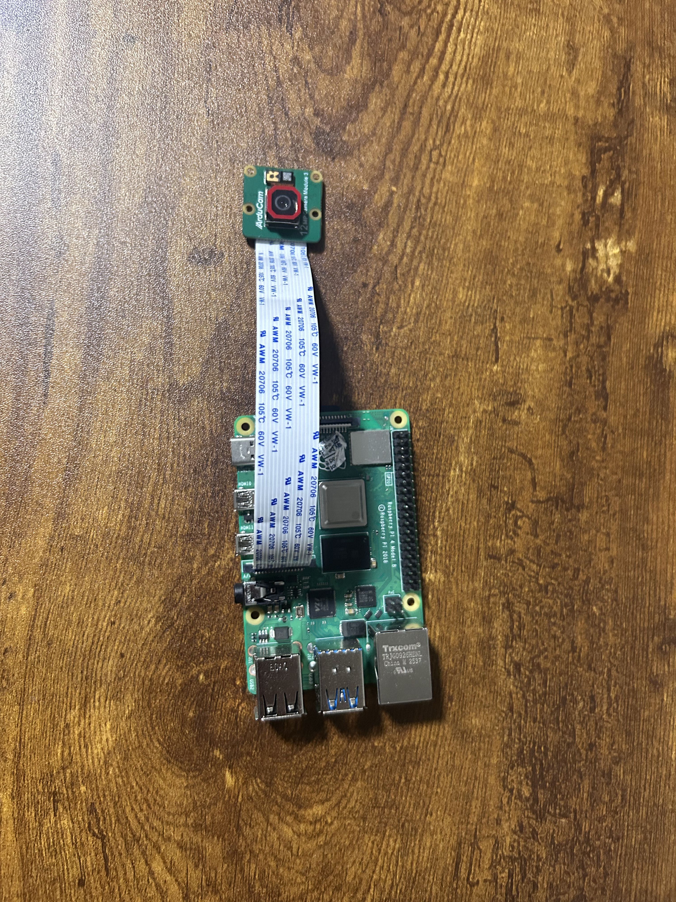
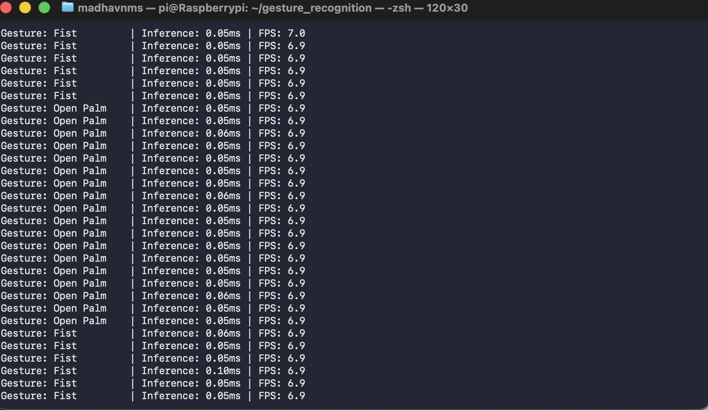
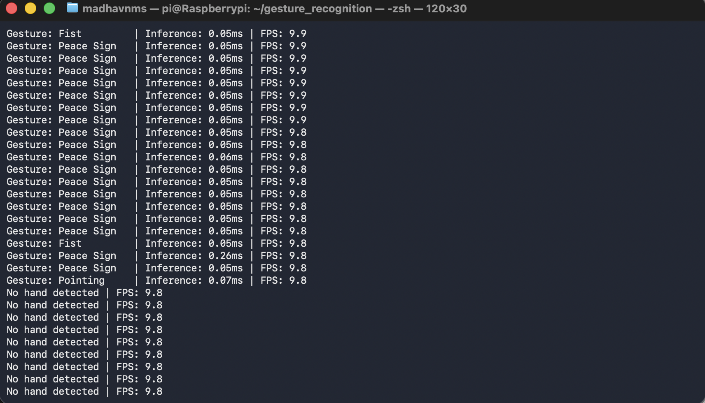
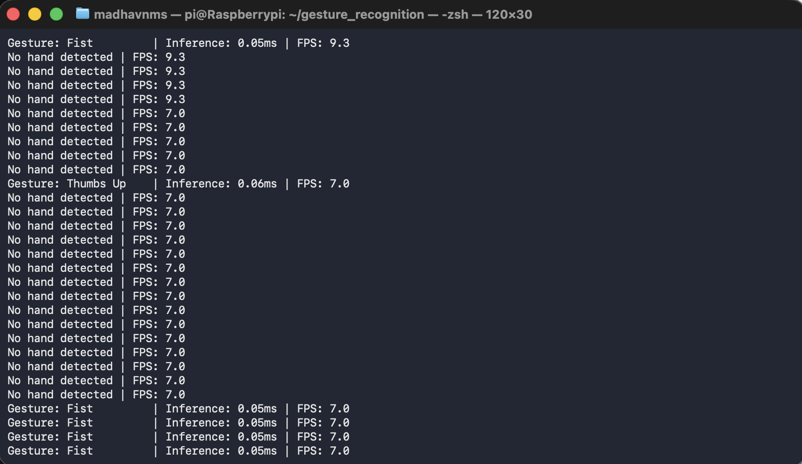
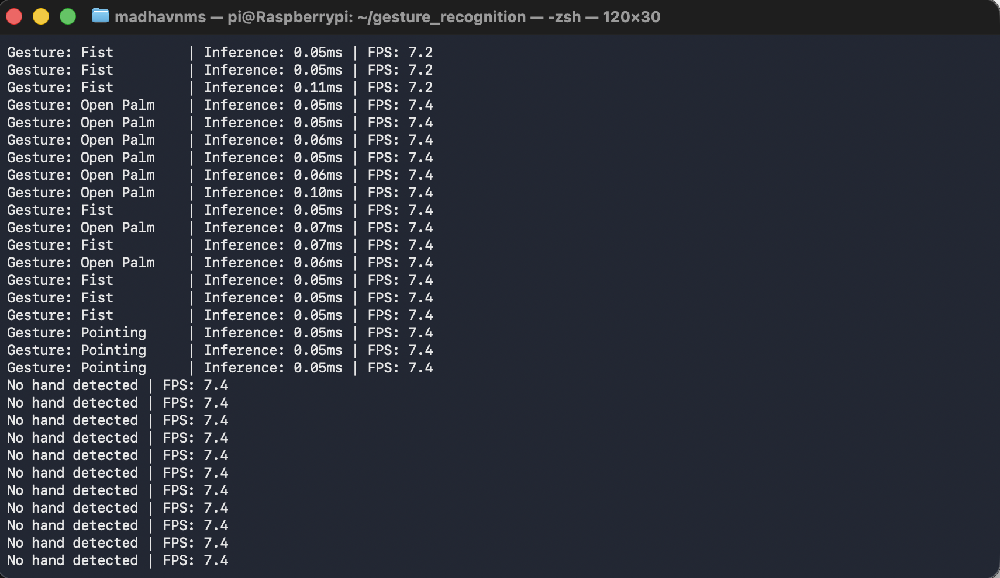
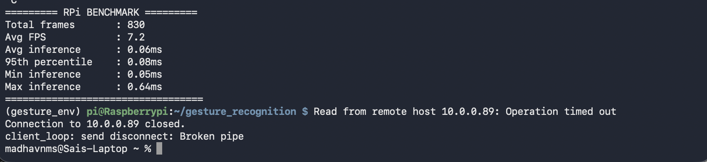

# GestureNet

Real time hand gesture recognition running entirely on a Raspberry Pi 4. A INT8 quantised neural network that classifies five hand gestures from a live camera feed with sub millisecond inference latency on device.



## What it does

GestureNet recognises five static hand gestures - Open Palm ✋🏻, Fist 👊🏻, Thumbs Up 👍🏻, Peace Sign ✌🏻, and Pointing☝🏻 from a Raspberry Pi camera in real time. The full pipeline runs on a CPU only Raspberry Pi 4 (2 GB) with no machine learning accelerator.

## How it works

Rather than feeding raw images into a large convolutional network, GestureNet uses a two stage pipeline:

1. **MediaPipe Hands** extracts 21 hand landmarks (each a 3D point) from the camera frame, producing a 63 number geometric description of the hand.
2. **A small multi-layer perceptron** classifies that 63-number vector into one of five gestures.

This design reduces the input from ~920,000 pixel values to 63 geometric features, which is what makes a model and sub millisecond inference possible on a Raspberry Pi.

### Pipeline

```
Camera frame  →  MediaPipe Hands  →  Normalisation  →  Feature Scaling  →  INT8 Classifier  →  Gesture label
   (image)        (21 landmarks)      (wrist origin)    (scaler.pkl)        (~0.06 ms)
```

## Live recognition on the Pi

|  |  |
|  |  |


Final output from a single test session:




## Repository layout

```
GestureNet/
├── hand_tracker.py              # MediaPipe foundation — webcam + landmark display
├── data_collection.py           # Capture and normalise landmark samples to CSV
├── augmented_data.py            # Mirror landmarks to double the dataset
├── model_training.py            # Train the MLP, save model + scaler
├── TfLite.py                    # Convert to INT8 TensorFlow Lite, benchmark
├── live_demo.py                 # Real-time validation on a development PC
├── rpi_inference.py             # On-device inference on Raspberry Pi
├── gesture_data_augmented.csv   # Augmented dataset (2,000 samples, balanced)
├── gesture_model_int8.tflite    # Deployed model (19 KB)
├── scaler.pkl                   # Fitted StandardScaler — required for inference
├── confusion_matrix.png         # Test-set evaluation
└── images/                      # Hardware photo and on-device screenshots
```

## Reproducing the results

### On a development PC

```bash
hand_tracker.py        # Sanity check the camera and MediaPipe
data_collection.py     # Collect 200 samples per gesture
augmented_data.py      # Mirror to 400 per gesture (RUN ONCE ONLY)
model_training.py      # Train, evaluate, save .pkl files
TfLite.py              # Convert to INT8 TensorFlow Lite
live_demo.py           # Real-time test on the PC
```
The CSV committed to this repository is already augmented (2,000 samples). If you regenerate the dataset from scratch with `data_collection.py`, run `augmented_data.py` once to produce `gesture_data_augmented.csv`.

### On a Raspberry Pi

```bash
pip install -r requirements-rpi.txt
python rpi_inference.py
```

The Pi script needs only `gesture_model_int8.tflite` and `scaler.pkl` from this repository.

## Hardware

- **Raspberry Pi 4 Model B** (2 GB RAM)
- **Arducam 12 MP Camera Module 3** via the CSI ribbon connector
- No accelerator, no GPU — pure CPU inference

## Limitations

- Evaluation is on a single-session, single-subject dataset.
- The normalisation function is duplicated across three scripts rather than imported from a shared module.
- This project is completely dependent on MediaPipe

## License

MIT — see [LICENSE](LICENSE).
